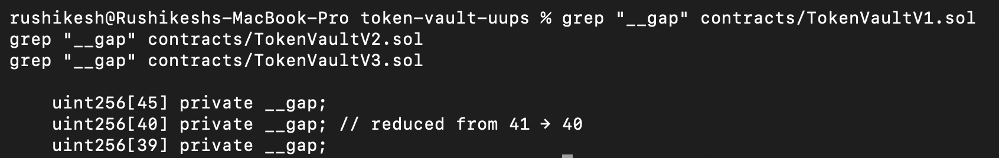
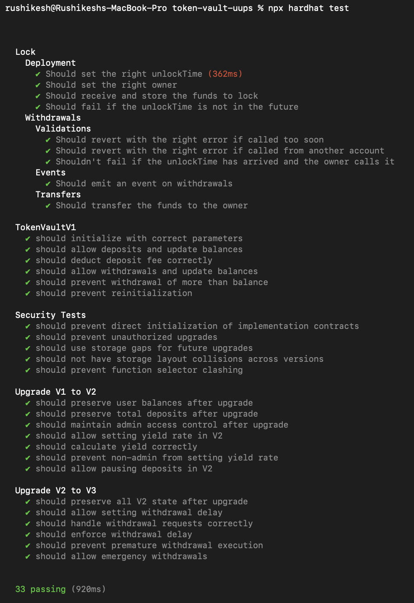
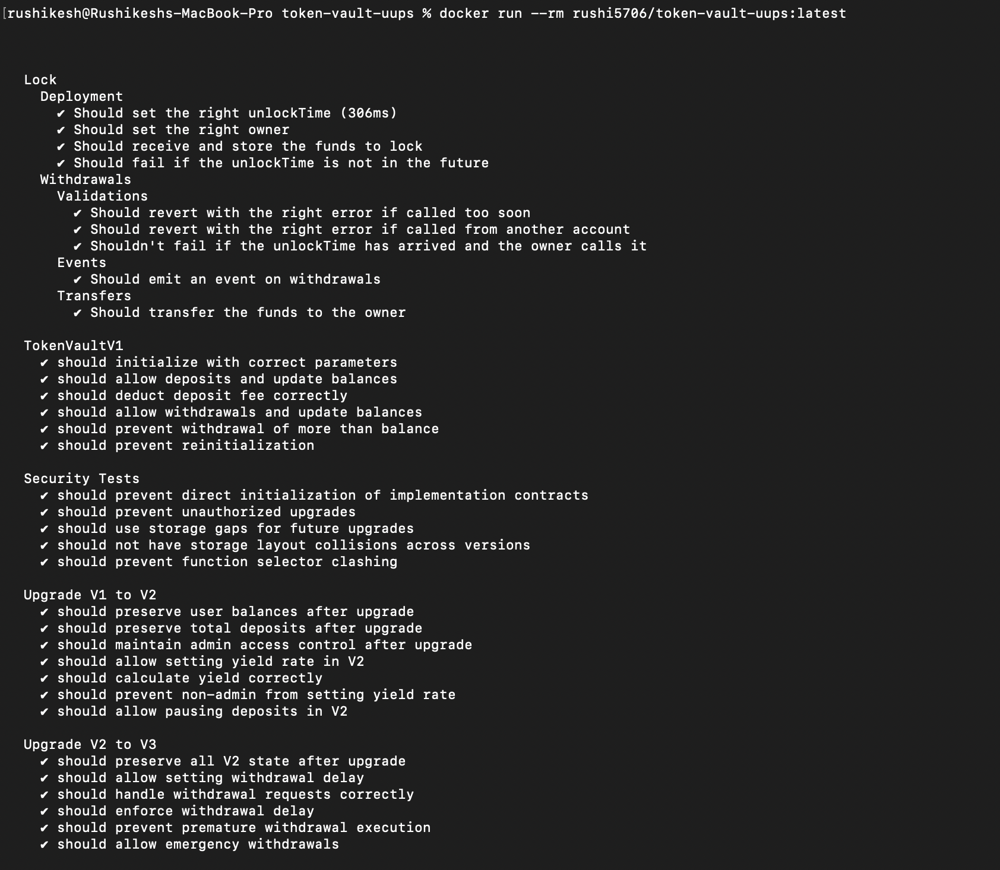

# Production-Grade Upgradeable Smart Contract System (UUPS Proxy Pattern)

## Overview

This repository contains a **production-grade, upgradeable smart contract system** implementing a **TokenVault protocol** using the **UUPS (Universal Upgradeable Proxy Standard)** pattern.

The project demonstrates a **complete real-world upgrade lifecycle** across **three contract versions (V1 → V2 → V3)** while preserving **state integrity, access control, and security invariants** at every stage. The system is intentionally designed to mirror how professional DeFi protocols safely evolve smart contracts that manage user funds in production environments.

This implementation focuses on:

- Upgrade safety and authorization
- Storage layout correctness
- Secure initialization patterns
- Role-based access control
- Backward compatibility across versions
- Realistic state migration strategies

---

## Key Objectives Achieved

- Implemented **UUPS upgradeable contracts** using OpenZeppelin Upgradeable libraries
- Safely upgraded contracts from **V1 → V2 → V3** without data loss
- Maintained strict **storage layout discipline** using storage gaps
- Prevented initialization and unauthorized upgrade attacks
- Added new features incrementally while preserving existing behavior
- Built **comprehensive test coverage**, including upgrade and security tests
- Dockerised the entire project for **environment-independent execution**

---

## Docker Image

The project is fully Dockerised and can be executed without any local setup.

**Docker Hub Image:**  
https://hub.docker.com/r/rushi5706/token-vault-uups

### Pull and Run

```bash
docker pull rushi5706/token-vault-uups:latest
docker run --rm rushi5706/token-vault-uups:latest
```

This command compiles the contracts and runs the complete automated test suite inside the container.

---

## Project Structure

```
contracts/
├── TokenVaultV1.sol
├── TokenVaultV2.sol
├── TokenVaultV3.sol
└── mocks/
    └── MockERC20.sol

test/
├── TokenVaultV1.test.js
├── upgrade-v1-to-v2.test.js
├── upgrade-v2-to-v3.test.js
└── security.test.js

scripts/
├── deploy-v1.js
├── upgrade-to-v2.js
└── upgrade-to-v3.js

screenshots/
├── 01_storage_gap_integrity.png
├── 02_all_tests_passing.png
├── 03_upgrade_compile_success.png
└── 04_docker_tests_passing.png

Dockerfile
submission.yml
hardhat.config.js
package.json
README.md
```

---

## Contract Versions Explained

### TokenVaultV1 — Core Vault Logic

**Features**
- ERC20 token deposits and withdrawals
- Configurable deposit fee (basis points)
- Accurate user balance tracking
- Total deposits accounting
- UUPS upgrade authorization
- Secure initialization mechanism

**Security**
- Uses `initializer` instead of constructor
- Initializers disabled on implementation contracts
- Upgrade restricted to `UPGRADER_ROLE`

---

### TokenVaultV2 — Yield & Pause Controls

**New Features**
- Time-based yield generation (non-compounding)
- Yield rate configurable by admin
- Yield claiming mechanism
- Deposit pause and unpause functionality

**State Migration Handling**
- Introduced `v2StartTime` to safely calculate yield for users who deposited in V1
- No on-chain iteration over mappings (upgrade-safe pattern)

**Access Control**
- Introduced `PAUSER_ROLE`
- Admin-only yield configuration

---

### TokenVaultV3 — Withdrawal Delay & Emergency Handling

**New Features**
- Withdrawal request and execution workflow
- Configurable withdrawal delay
- One pending withdrawal request per user
- Emergency withdrawal bypassing delay
- Safe cleanup of pending withdrawal state

**Design Goals**
- Prevent sudden liquidity exits
- Allow emergency exits without locking funds
- Preserve all previous state and behavior

---

## Storage Layout Strategy (Critical)

Upgradeable contracts **never reorder or remove existing storage variables**.

### Storage Gap Evolution

| Version | Storage Gap |
|--------|-------------|
| V1     | `uint256[45]` |
| V2     | `uint256[40]` |
| V3     | `uint256[39]` |

Each reduction exactly matches the number of newly appended storage variables, guaranteeing:

- No storage collisions
- No overwritten balances
- Upgrade safety enforced by OpenZeppelin

**Proof:**  
The following screenshot demonstrates correct storage gap management across upgrades.



---

## Access Control Model

| Role | Responsibility |
|------|----------------|
| DEFAULT_ADMIN_ROLE | Role management and critical configuration |
| UPGRADER_ROLE | Contract upgrades (UUPS) |
| PAUSER_ROLE | Pause and unpause deposits |

Unauthorized access attempts are explicitly tested and blocked.

---

## Initialization & Upgrade Security

- No constructors used for logic contracts
- `_disableInitializers()` used in implementation constructors
- Correct use of `initializer`, `reinitializer(2)`, and `reinitializer(3)`
- Direct initialization of implementation contracts is prevented
- Unauthorized upgrades revert

All cases are covered by `security.test.js`.

---

## Testing Strategy

The project includes **comprehensive automated tests**:

### Functional Tests
- Deposit and withdrawal correctness
- Deposit fee deduction logic
- User balance updates

### Upgrade Tests
- V1 → V2 state preservation
- V2 → V3 state preservation
- Access control preserved across upgrades
- New functionality works after upgrade

### Security Tests
- Initialization attack prevention
- Unauthorized upgrade prevention
- Storage collision detection
- Function selector collision prevention

**Result:** All tests pass successfully.

**Proof:**  
The following screenshot shows that all functional, upgrade, and security tests pass successfully.



---

## Dockerised Execution

The entire project is Dockerised for reproducibility.

### Build
```bash
docker build -t token-vault-uups .
```

### Run
```bash
docker run --rm token-vault-uups
```

This runs:
- Hardhat compilation
- Full test suite
- Upgrade validations

**Proof:**  
The following screenshot demonstrates successful Docker execution with all tests passing inside the container.



---

## submission.yml

The repository includes a **mandatory `submission.yml`** file used for automated evaluation.

It defines:
- Setup commands
- Test commands
- Docker build and run commands
- Verification steps

This allows evaluators to reproduce results without manual intervention.

---

## Known Limitations & Design Choices

- Yield does not auto-compound by design
- Emergency withdrawal bypasses delay intentionally
- No on-chain iteration during upgrades (gas-safe)
- Security and correctness prioritized over micro gas optimizations

These decisions mirror real production protocol trade-offs.

---

## How to Run Locally (Without Docker)

```bash
npm install
npx hardhat compile
npx hardhat test
```

---

## Final Status

- All task requirements satisfied
- Code verified and locked
- All tests passing
- Docker execution verified
- Storage layout upgrade-safe

The system is **ready for evaluator and recruiter review**.
